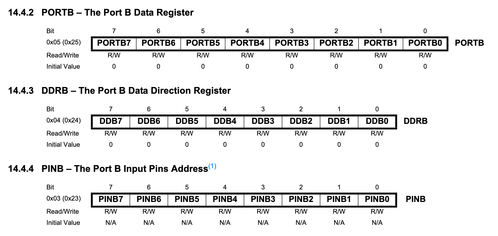
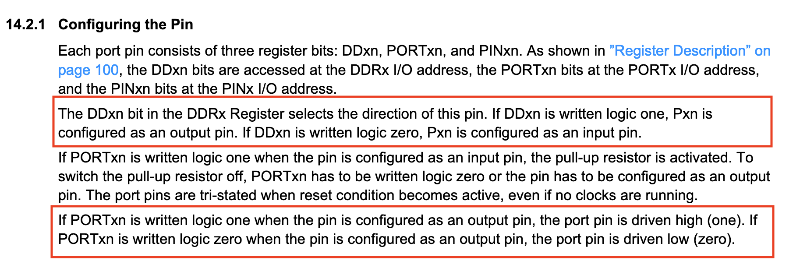

# Hello World Explained

Whew! That was a lot of work to just to blink a light!  
Now that we've verified our toolchain by compiling and uploading the blink example, let's take a closer look at the code.

```c
#include <avr/io.h>
#include <util/delay.h>

int main(void)
{
    DDRB |= (1 << DDB5);

    for(;;)
    {
        PORTB |= (1 << PORTB5);
        _delay_ms(500);
        PORTB &= ~(1 << PORTB5);
        _delay_ms(500);
    }
}
```

First, we're including some libraries from [avr-libc](https://www.nongnu.org/avr-libc/user-manual/index.html). 

```c
#include <avr/io.h>
#include <util/delay.h>
```

`<util/delay.h>` pulls in the `_delay_ms()` function, while `<avr/io.h>` brings in the device specific IO definitions for the AVR processor, defined by the `-mmcu=atmega328p` flag we passed to the compiler. 

If you run `ls /usr/lib/avr/include/avr` inside our built tool container, you'll see header files for all of the supported processors. These files provide the different macros we've used here, like `DDRB` and `PORTB`. 

Let's take a look at `DDRB`.

```bash
grep --after-context=8 DDRB /usr/lib/avr/include/avr/iom328p.h
```

```c
#define DDRB _SFR_IO8(0x04)
#define DDB0 0
#define DDB1 1
#define DDB2 2
#define DDB3 3
#define DDB4 4
#define DDB5 5
#define DDB6 6
#define DDB7 7
```

This tells us that `DDRB` is defined as an 8 bit *Special Function Register* at memory address `0x04`. When we write to this address, we're manipulating a physical register on the processor. This is called *Memory Mapped IO*. In addition to memory having addresses, physical registers are also assigned addresses that we can read from and write to.

Knowing that `DDRB` is at address `0x04` doesn't tell us what it does though.  For that we need to search for it in the [datasheet fot the Atmega 328p](http://ww1.microchip.com/downloads/en/DeviceDoc/ATmega48A-PA-88A-PA-168A-PA-328-P-DS-DS40002061A.pdf).

[](./img/atmega328p_portb.png)

This tells us that `DDRB` stands for "Port B Data Direction Register" and confirms that it resides at address `0x04`. 

A bit more digging around the datasheet will reveal this section about configuring the GPIO ports.

[](./img/atmega328p_gpio_config.png)

So, this register controls whether a particular pin on `PORTB` is an *input* or an *output*. Looking back at our code,

```c
int main(void)
{
    DDRB |= (1 << DDB5);

    /* ... */
}
```

we write to the data direction register before entering the main loop.  
Since we're *controlling* a light, this line of code must be setting up the pin to be an output. In fact, if we refer back to the datasheet, it must somehow be writing a value of `1` to the 5th bit of the register.

In order to explain exactly how that's happening, we need to take a segway into bit manipulation.

## Bitwise Operations

Most of us have never had a need to set individual bits inside of a byte before, but it's a very common need in bare metal programming.  
As you've seen, we change the state of our processor by setting individual bits in memory mapped registers, so it's important we understand what different bitwise operators do, and some common idioms.

### Left Shift ( << )

Left shift does exaclty as it's name suggests, it shifts a single bit `x` positions to the left and fills in the right hand side with zeros. Let's take an 8 bit integer (byte) with a value of 1.

```c
0xb00000001
```

And then shift it one to the left

```c
0b00000001 == 1
0b00000001 << 1
0b00000010 == 2
```

So, if we go back to the code that sets up the pin as an output

```c
DDRB |= (1 << DDB5);
```

We can see in our datasheet (and from the header file we grepped!) that `DDB5 == 5`, so we can subsitute in

```c
DDRB |= (1 << 5)
```

And then left shift 5 places

```c
0b00000001 << 5
0b00100000 == 32

DDRB |= (1 << 5)
DDRB |= 0b00100000
```

### Or ( | )

The `|=` operator is the "OR assignment" operator.  
Much like how `foo += 10` expands to `foo = foo + 10`, 

```c
DDRB |= 0b00100000
```

expands to 

```c
DDRB = DDRB | 0b00100000
```

The OR operator takes the bitwise OR of two values.  
If either of the bits in a given position is a `1`, then the operation outputs a `1` in that position. If both bits are `0`, then the operation outputs a `0`.

Example:

`1 | 2`

| bits   | value |
| ------ | ----- |
| `0001` | 1     |
| `0010` | 2     |
| `0011` | 3     |

If a bit is unset, OR-ing it with a value that has that bit on, results in that bit being turned on.  
If it's already on, it stays on. 
So, by setting `DDRB` to the OR-ed value of itself and `0b00100000`, we are setting the the 5th bit of `DDRB` to `1`, which sets the pin to `OUTPUT`. 

Going back to our "Hello World" code, we can see that this pattern is repeated for `PORTB`.

```c
DDRB |= (1 << DDB5);

for(;;)
{
    PORTB |= (1 << PORTB5);
    _delay_ms(500);
    PORTB &= ~(1 << PORTB5);
    _delay_ms(500);
}
```

If we go back and check the datasheet again, we see that writing to `PORTB` when it's setup as an `OUTPUT` drives the pin `HIGH`.

[](./img/atmega328p_gpio_config.png)

And if we check the [Arduino Graphical Datasheet](https://cdn.sparkfun.com/assets/1/3/5/9/6/Redboardv2.pdf), we'll see that Arduino Pin 13 is mapped to `PORTB5`. So, by setting the 5th bit of `PORTB`, we turn the on board LED on!

Then we delay for half a second, then... this.

```c
PORTB &= ~(1 << PORTB5)
```

We've seen bit shifting before, but now we're introducing two new bitwise operators.

### NOT ( ~ )

The NOT operator is the bitwise *negation* of an integer.  
Every `0` turns into a `1` and vice versa.

Example:

`~3`

| bits   | value |
| ------ | ----- |
| `0011` |  3    |
| `1100` | 12    |

`~(1 << PORTB5)`

| bits       | operation |
| ---------- | --------- |
| `00000001` |           |
| `00100000` | << 5      |
| `11011111` | ~         |

### AND ( & )

The AND operator performs a bitwise AND.  
If both bits in a position are `1`, the operation outputs a `1`.  
Otherwise, it outputs a `0`.

Examples:

`1 & 2`

| bits   | value |
| ------ | ----- |
| `0001` | 1     |
| `0010` | 2     |
| `0000` | 0     |

`2 & 3`

| bits   | value |
| ------ | ----- |
| `0010` | 2     |
| `0011` | 3     |
| `0010` | 2     |

So, when we take the existing value of `PORTB` and set it to itself AND-ed with `~(1 << 5)`, we're *clearing* (turning off) the 5th bit in the register.


```c
PORTB &= ~(1 << PORTB5)
PORTB = PORTB & ~(1 << PORTB5)
PORTB = PORTB & ~(1 << 5)
PORTB = PORTB & ~(0b00100000)
PORTB = PORTB & 0b11011111
```

## Conclusion

It's okay if you didn't fully grasp all of that.  
The important thing to remember is that if we want to set a bit use:

```c
REGISTER |= (1 << bitPosition)
```

And if you want to clear a bit use: 

```c
REGISTER &= ~(1 << bitPosition)
```

Using what we've learned, we can refactor our code to be much more human readable.

```c
#include <avr/io.h>
#include <util/delay.h>

void setup_onboard_led_as_output()
{
    DDRB |= (1 << DDB5);
}

void turn_onboard_led_on()
{
    PORTB |= (1 << PORTB5);
}

void turn_onboard_led_off()
{
    PORTB &= ~(1 << PORTB5);
}

int main(void)
{
    setup_onboard_led_as_output();

    for(;;)
    {
        turn_onboard_led_on();
        _delay_ms(500);
        turn_onboard_led_off();
        _delay_ms(500);
    }
}
```

[Prev](./01-hello-world.md)
[Next](./03-offboard-leds.md)