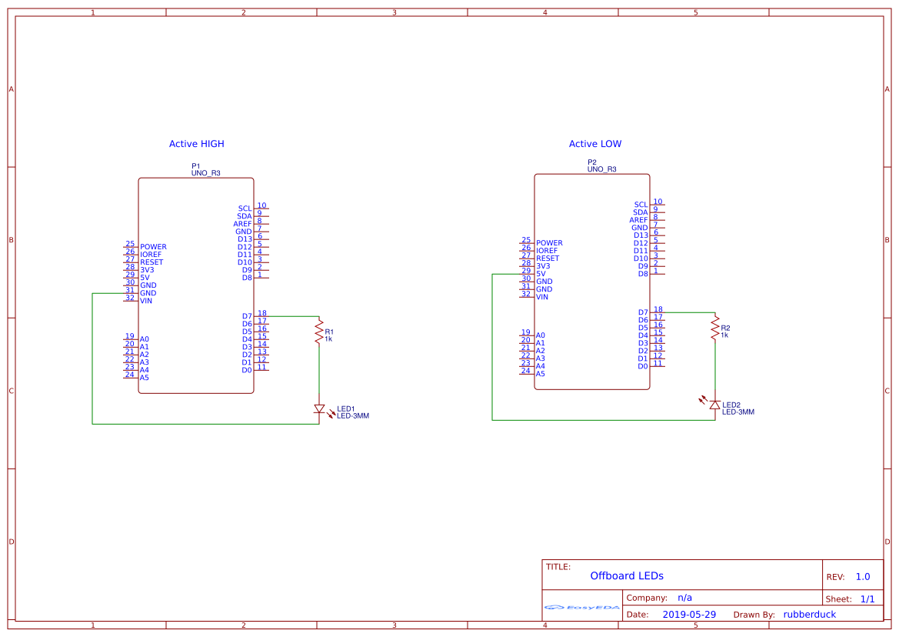

# Exercise: Offboard LEDs

Now that we know how to blink the on-board led on Pin13, bust out your breadboard and wire up a led to a different pin and use the [datasheets](./README.md#Datasheets) to update the hello world code accordingly.

[](./img/Schematic_LEDs_Active_Low_Active_High.png)

This time, we'll vary the on/off time so we can note how wiring the LED differently changes the program’s behavior.

```c
int main(void)
{
   //initialize

   for(;;)
   {
       //light on
       _delay_ms(500);
       //light off
       _delay_ms(1000);
   }
}
```

Additional Resources:
- [How to use a breadboard](https://learn.sparkfun.com/tutorials/how-to-use-a-breadboard/all)
- [LED Tutorial](https://learn.sparkfun.com/tutorials/activity-guide-for-sparkfun-tinker-kit/circuit-1-blink-an-led)
- [Active High vs. Active Low](https://learn.sparkfun.com/tutorials/logic-levels/all#active-low-and-active-high)