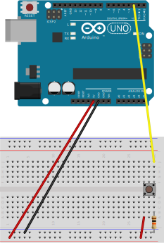
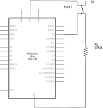
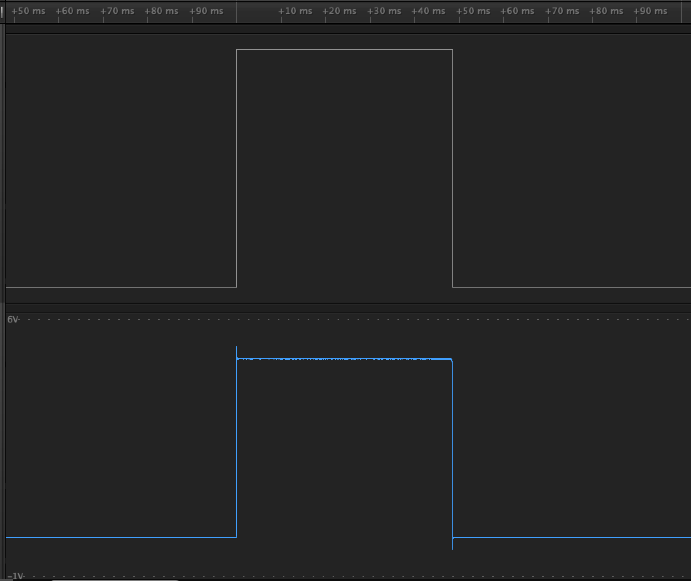
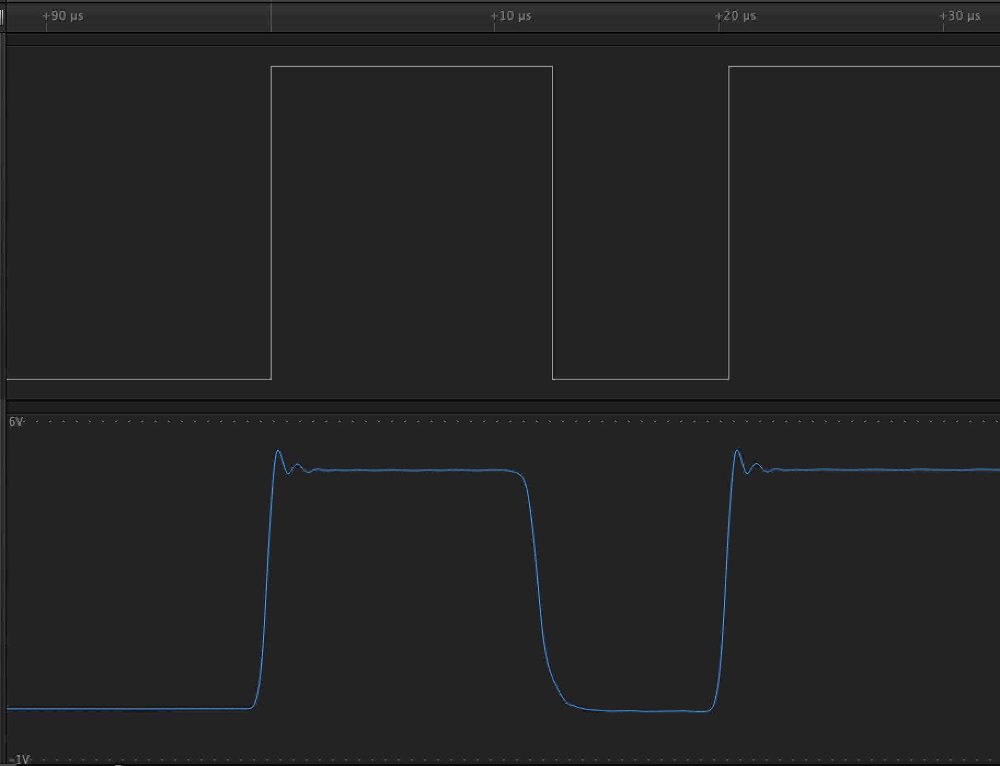
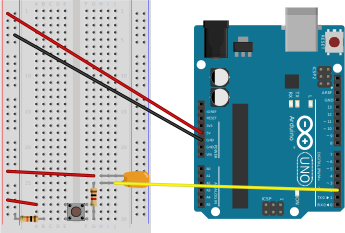
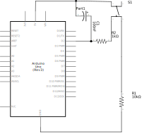
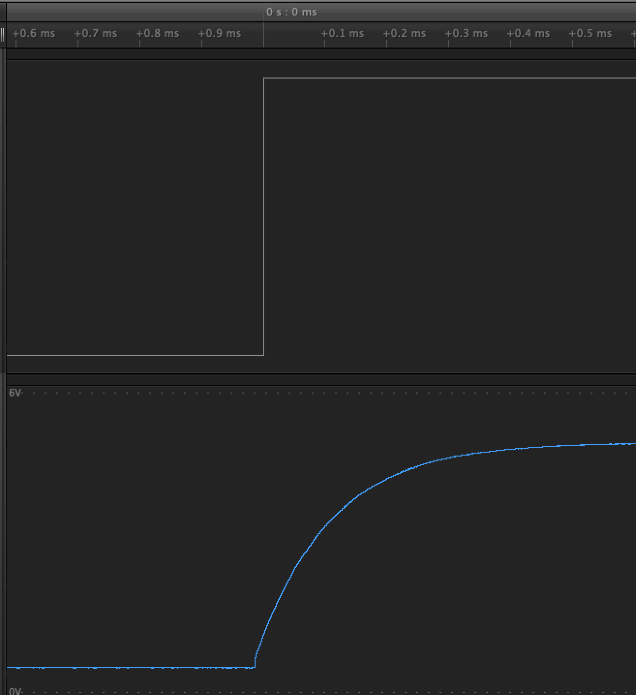

# Interrupts

Interrupts provide us a way of running some code when an _event_ occurs. 
There are several kinds of interrupts that may occur in a system, 
but today we'll use _external_ interrupts as an example. 
External interrupts allow us to react to voltages changes coming into our processor from external devices, like buttons.

To illustrate this, we'll implement a small program that turns a light on and off when a button is pressed.

This is a diagram of the hardware setup required for this exercise.



And the electrical schematic for those such inclined.



The input on D2 is pulled to ground with a resistor. 
When the button is pressed, the circuit is closed and the voltage rises from 0V to 5V.



Our software will toggle the state of the built in LED on D13 whenever the button is pressed, along the rising edge of the signal.

To make building and installing easy, we'll start with an existing `makefile`.  
We'll then modify the code in `src/Demo.c` accordingly.

```sh
git clone https://github.com/rubberduck203/avr-template.git interrupts
cd interrupts
make
make install
```

We'll start by including `<avr/io.h>` and writing a few functions for the LED.

```c
#include <avr/io.h>

void led_init()
{
    /* setup D13 led as output */
    DDRB |= (1 << DDB5);
}

void led_toggle()
{
    /* toggle on board LED */
    PINB |= (1 << PINB5);

    // can also use xor
    //PORTB ^= (1 << PORTB5);
}
```

We've set up this LED as an output quite a number of times now, but the toggle function is new. According to the datasheet: 

> 14.2.2   Toggling the PinWriting a logic one to PINxn toggles the value of PORTxn, independent on the value of DDRxn. Note that the SBI instruction can be used to toggle one single bit in a port.

So, anytime we set the appropriate bit in the `PINB` register, the light will toggle on or off, depending on it's current state. 
We could also use the `xor` operator, if we so desired. 
Learning about the `xor` operator is an extension of the bit twiddling we did in the [hello world example](./02-hello-world-explained.md) and left as an exercise for the reader.

With that out of the way, we'll setup our button input as an interrupt. 

```c
#include <avr/interrupt.h>

void button_init()
{
    DDRD &= ~(1 << DDD2); // setup as input   
    //  External Interrupt Control Register A
    EICRA |= ((1 << ISC00) | (1 << ISC01)); //rising edge
    // External Interrupt Mask Register
    EIMSK |= (1 << INT0); // enable
}
```

We do this by first setting up the GPIO pin as an `input` (instead of an output as we've done to date). 
Next, we reference the datasheet to configure the external interrupt on pin D2 (`INT0`) to trigger on rising edge.

> 13.2.1   EICRA – External Interrupt Control Register A
> 
> 
> 
> **Interrupt 1 Sense Control**  
> Table 13.1 Page 80
>
> | ISC11 | ISC10 | Description |
> | ----- | ----- | ----------- |
> | 0     | 0     | The low level of INT1 generates an interrupt request. |
> | 0     | 1     | Any logical change on INT1 generates an interrupt request. |
> | 1     | 0     | The falling edge of INT1 generates an interrupt request. |
> | 1     | 1     | The rising edge of INT1 generates an interrupt request. |

Finally, we reference the datasheet again, using the External Interrupt Mask (`EIMSK`) register to enable the `INT0` interrupt. 

Now that we've setup our interrupt, we need to write the code to call our `led_toggle()` function whenever the interrupt is triggered. 
We do this by using the `ISR` macro, or "Interrupt Service Routine". 
This macro maps our code to an interrupt _vector_ that resides at a specific address. 
When the interrupt is triggered, it will execute the code residing at this address. 
In our case, we're using the `INT0` interrupt, so we'll use the corresponding vector `INT0_vect`.

```c
ISR (INT0_vect)
{
    led_toggle();
}
```

Finally, we'll pull all of the pieces together.

```c
int main(void) 
{
    led_init();
    button_init();
    sei(); // enable global interrupt
    
    for(;;)
    { 
        /* 
         * Nothing to do. 
         * The interrupts handle everyting.
         */
    }

    return 0;
}
```

You'll notice that in our init code, we not only init our button and led, but also call `sei()`. 
This is the "Set Enable Interrupt" function, which globally enables interrupts for our application. There is also a `cli()`, or "Clear Interrupt" function that _disables_ all interrupts.

It's also interesting to note that our main loop does nothing. 
For our simple program, it's not necessary to do anything in the loop, 
but it's important to understand that you may want or need to also have code in the main loop. 
In these cases, the main function will stop executing while the interrupt is running, 
then return to where it left off when the interrupt is complete. 
Because the interrupt, well... _interrupts_ the main loop, it's important to keep interrupt service routines as small and fast as possible. 
Often, you'll simply set a register or variable in the ISR and then use that value to do longer processing in the main loop.

```c
bool doThing = false;
ISR(INT0_vect)
{
    doThing = true;
}

int main(void) 
{
    //...
    
    for(;;)
    { 
        if (doThing)
        {
            DoStuff();
            doThing = false;
        }

        // Do other stuff
    }

    return 0;
}
```

## Low Power

You may be asking yourself why we went through all this trouble to use interrupts when we could have just checked the value of the input pin in our main loop. 
The reason is that the polling method is _very_ energy inefficient. 
When you're polling, the MCU is running all the time. 
When we use interrupt driven programs, we can put the processor to sleep when it has nothing to do.

```c
#include <avr/io.h>
#include <avr/interrupt.h>
#include <avr/sleep.h>

/* other functions omitted for brevity */

int main(void) 
{
    led_init();
    button_init();
    sei(); // enable global interrupt
    
    set_sleep_mode(SLEEP_MODE_STANDBY);
    for(;;)
    { 
        sleep_mode();
    }

    return 0;
}
```

Using the standby mode, we only wake up the processor when an interrupt occurs. This can save significantly on power usage, which matters alot when your device is running on a battery.

[The full code for this chapter can be found here.](./05-interrupts.c)

## Debouncing

By now you've built the program, flashed it to the board, and noticed that the button doesn't always work as intended. 
This is because I kind of lied a bit earlier. 
The signal coming in from a button or switch isn't really a nice square wave. In reality, it will look more like this.



This is called "bouncing" and will cause our interrupt to be fired multiple times, once for each rising edge. 

We can fix this in hardware by adding a capacitor and extra resistor to our circuit (an RC filter). It's not an optimal hardware solution, but will fit most of our hobbyist needs.




This filter smooths out the bouncing, giving us a single rising edge to trigger on.



Of course, this requires extra hardware, which adds to our BOM (Bill of Materials) cost. Sometimes we may want to avoid that cost and added hardware complexity and debounce using software.

As a challenge, wire back up our original circuit and implement some software that debounces the button.